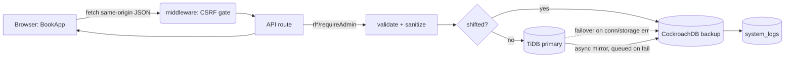
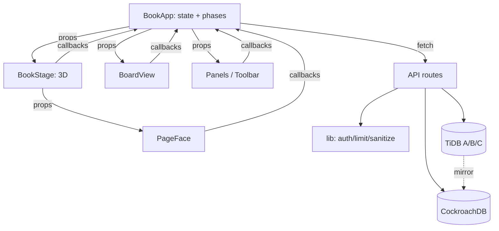

# Libris — High-Level Flow

> 5-minute big picture for newcomers. Bullets, not paragraphs.
> Deep companion: `docs/technical-flow.md`. Product tour: `README.md`.

## 1. Entry point

- **Web:** `src/app/layout.tsx` (`RootLayout`) → `src/app/page.tsx` (`Home` → `<BookApp/>`). No logic on `/` itself.
- **Gate:** `src/middleware.ts` (matcher `/api/:path*`) — GET/HEAD/OPTIONS pass; other methods need matching `Origin/Referer` vs `Host` (`src/lib/csrf.ts`). Headerless clients (curl) pass.
- **State zero:** `BookApp` boots in `front` phase → fetches `/api/book` → `/api/notes?bookId` → `/api/board` → probes `/api/health` → resolves identity from `localStorage` (all client-side, post-mount — never during SSR).
- **Why here:** `BookApp` owns book/pages/margin-notes/presence/phases; `BoardView` and `NotesPanel` own and fetch their own lists (`BoardView` state + `fetch('/api/board')`, `NotesPanel` state + per-page fetches). Stage/faces/panels are otherwise views fed by props + callbacks.

## 2. Execution flow

**Opening the book (front → reading):**
1. `openBook()` fires `GET /api/book` + `/api/notes` + `/api/board` in parallel.
2. Book, pages, margin notes land in state; veil shows counts (“arranged”).
3. `stageRef.open()` swings the 3D cover; phase flips to `reading`, toolbar appears.

**Writing (autosave):**
1. Keystroke → `PageFace` sanitizes HTML client-side → 700 ms debounce.
2. `BookApp.savePage()` merges into `pendingEdits` + optimistic UI.
3. `PATCH /api/pages/[id]` → 200 clears draft · 423 keeps draft (foreign lease) · 404 refetches book.
4. Server lists always merge *over* `pendingEdits` — typing can never be clobbered.

**A typical API write (`POST /api/pages`):**
1. Auth + rate-limit (order varies: reads like `GET /api/board` go auth-first; destructive/restore routes limit *before* auth — no 401 oracle).
2. `requireAdmin` (open mode when `ADMIN_TOKEN` unset).
3. Validate (strict JSON → 415) → sanitize HTML → idempotency-key replay check.
4. `withTiDBFallback`/`withStorageShift`: TiDB primary, CockroachDB fallback (validation errors never fork).
5. Fire-and-forget replicate to backup (queued on failure) → `logActivity` → 201.

**Presence (every 10 s):**
1. `beatPresence()` POSTs heartbeat (+ optional lock acquire/release) to `/api/presence`.
2. Response carries `users` + `locks` + version signal → state; version change triggers refresh.
3. Stale tabs pruned server-side (30 s TTL); own leases refreshed.

## 3. Major components / modules

- `src/app/page.tsx`, `layout.tsx` — root shell, fonts, toaster, global CSS.
- `src/components/BookApp.tsx` — orchestrator: all server state, phases, autosave, presence loop, sweepers.
- `src/components/book/BookStage.tsx` — 3D rig: single rAF loop, flips, riffle, zoom, drag-to-turn.
- `src/components/book/PageFace.tsx` — one writable ruled page (sanitize, toolbar portal, pin/remove/+).
- `src/components/book/{SearchBar,NotesPanel,IndexPanel,FloatingEditorToolbar}.tsx` — search, per-page notes, index drawer, format toolbar.
- `src/components/board/BoardView.tsx` — sticky/card felt canvas: drag/resize, trash/purge, timeline, send-to-book.
- `src/components/IdentityGate.tsx` — name+PIN claim/verify or direct continue (no accounts).
- `src/app/health|storage|dashboard/page.tsx` — observability dashboards (health+presence+quota; telemetry+snapshot controls; alias).
- `src/app/api/**/route.ts` — ~20 routes: book, pages, notes, board, search, presence, identity, backup, storage, health.
- `src/lib/turso.ts` — backup-engine front (name is historical): snapshots, LWW restore, shift/failover, replication queue, merged reads. Talks CockroachDB.
- `src/lib/{db,db-backup,users-db}.ts` — Prisma singletons (books/notes clusters, CockroachDB, users cluster), cached on `globalThis`.
- `src/lib/usrinfo.ts` — identities, presence, page leases on the users cluster.
- `src/lib/{auth,rate-limit,csrf,sanitize,logger,identity*}.ts` — gates, limits, XSS allowlist, audit log, name/PIN rules + crypto split.
- `prisma/*.prisma` — 4 schemas → 4 generated clients in `src/generated/*`.
- `scripts/` — manual live-DB probes (verify, seed, backup CLI, failover suite). Never CI.
- `tests/unit/` — DB-free vitest suite (sanitizer, limiter, failover rules, CSRF, identity).

## 4. How components talk to each other

- **Down:** `BookApp` → props (`pages`, `locks`, `identity`, callbacks like `onSavePage`, `onGoToPage`). `BookStage`/`PageFace` never fetch; `BoardView`/`NotesPanel` fetch their own lists.
- **Up:** leaf callbacks (`onSavePage`, `onCreatePage`, `onLockAcquire`) → `BookApp` mutates state and/or calls APIs.
- **Client → server:** `fetch` JSON to same-origin `/api/*` only (CSP `connect-src 'self'`). Leaf components delegate through `BookApp`, except `NotesPanel`, `BoardView`, `SearchBar`, `IdentityGate`, dashboards which call their own routes.
- **Route → lib:** routes compose `auth` + `rate-limit` + `sanitize` + `db*` + `backup-engine`/`usrinfo` + `logger`. Data passed: validated DTOs in, `{isShifted, engine}` labels out to the audit log.
- **Server → DB:** Prisma clients per cluster; `backup-engine.ts` wraps dual-engine logic (primary attempt → fallback → async mirror → queue).
- **Cross-engine glue:** merged reads dedupe TiDB + shifted rows by id; replication queue flushes opportunistically on storage reads.
- **Presence side-channel:** heartbeat response piggybacks `versions`; a version bump triggers `refreshPages/refreshNotes` — no polling of content endpoints.

## 5. External dependencies

- **TiDB Cloud Serverless ×3** (`BOOKS/NOTES/USERS_DATABASE_URL`): books+pages, margin+board notes, identities+presence+leases.
- **CockroachDB Cloud, Basic** (`BACKUP_DATABASE_URL`): snapshots, restore source, shift overflow, replication mirror, `system_logs`.
- **Upstash Redis** (optional): shared rate-limit counters; else per-process memory.
- **Vercel**: hosting + env vars + `vercel-build` (generates 4 Prisma clients, patches tracing markers, builds).
- **No auth provider, no mail, no storage bucket, no analytics.** Fonts are local woff2 (prod CSP bans remote fonts).

## 6. Key design decisions / patterns

- **Public-by-design, no login** — identity = typed name + optional PIN claim (continuity, not auth). `ADMIN_TOKEN` unset = open mode.
- **Dual-engine with honest fallback** — TiDB primary, CockroachDB overflow; validation errors never fork (no split-brain); shifted rows merge back into reads.
- **Tombstones, never hard deletes** — pages park at negative numbers; restore is last-write-wins with stale/tombstone skips; only explicit `prune` truly deletes.
- **Optimistic UI + draft ownership** — `pendingEdits` survive server refetches; flush guards stop page-A text landing on page B.
- **Measured, not fabricated telemetry** — content bytes via SQL sums, `bytesMeasured` flags, quotas labeled with source (`*_QUOTA_BYTES` overrides).
- **Defense in layers** — CSRF middleware → limit-before-auth → allowlist sanitizer (server+client mirrors) → CSP headers → confirm-gated destructives.
- **Singletons on `globalThis`** — one Prisma pool per engine across hot reloads/serverless workers.
- **No fossil naming** — the old `turso.ts`/Turso-DB names were migrated to `backup-engine.ts` + `backup*` exports end to end (routes, scripts, tests, docs), so names match the CockroachDB reality.
- **Scripts are live-DB probes, tests are DB-free** — `npm test` never touches a database.
